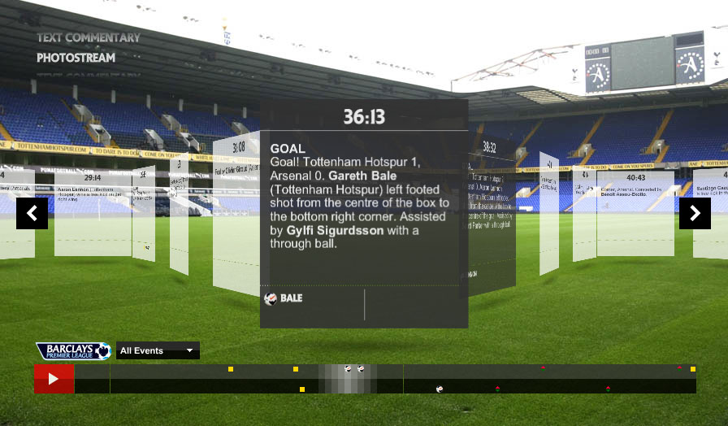
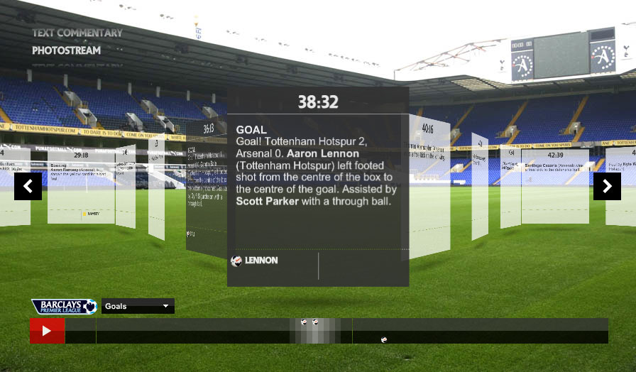
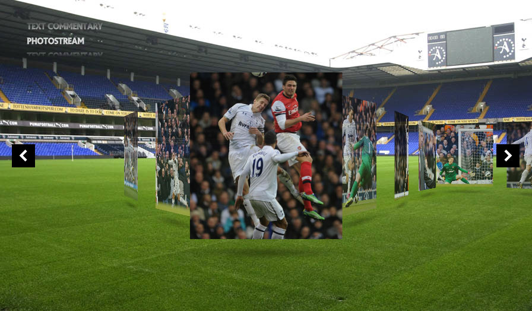
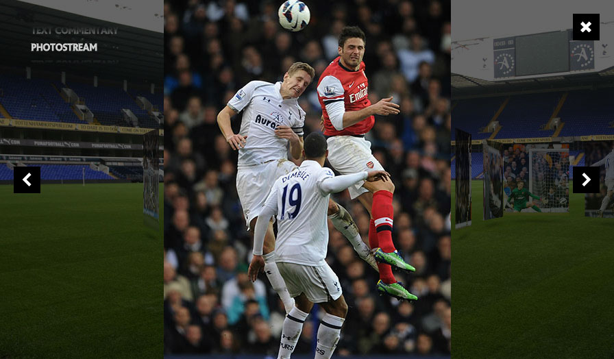

+++
title = 'Premier League Commentary Widget'
date = 2024-12-10T13:57:42Z
draft = true
summary = 'Commentary Widget for the Premier League website'
[params]
  type = 'Development'
  client = 'Premier League'
  agency = 'VML'
  year = '2011'
  video = 'L-hyRjEjSMc'
+++

# Premier League Commentary Widget

I created the Commentary Widget for the Premier League website.

Then I did something else.
